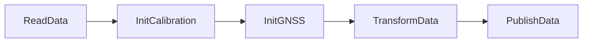
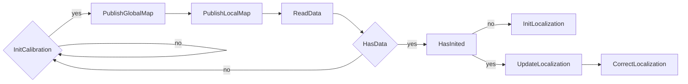

## Data Pretreat Flow

## Kitti Filtering Flow


## 卡尔曼矫正流程

$$
\begin{align}
非线性模型：\\
x_k&=\underline{f(x_{k-1},u_{k-1},w_{k-1})} \qquad \qquad w \sim N(0,Q)\\
z_k&=\underline{h(x_k,v_k)} \qquad \qquad \qquad \qquad \quad v \sim N(0,R)\\
先验估计:\\
\hat{x}_{k,EST}&=\underline{f(\hat{x}_{k-1},u_{k-1},0)}\\
先验误差协方差:\\
P_{k,EST}&=AP_{k-1,EST}A^\top+\underline{WQW^\top}\\
卡尔曼增益:\\
K_k&= P_{k,EST}H^\top(H P_{k,EST}H^\top +\underline{VR_{k,EST}V^\top})^{-1}\\
后验估计:\\
\hat{x}_k&=\hat{x}_{k,EST}+K_k (z_k-\underline{h(\hat{x}_{k,EST},0)})\\
更新误差协方差:\\
P_k &=(I-K_k H )P_{k,EST}
\end{align}
$$


卡尔曼Gain

```
K =  P_  *  G.transpose() * ( G  *  P_  *  G.transpose( )  +  C * RPose_*  C.transpose() ).inverse() ;
```


 ```mermaid
     graph LR
     A[KITTIFiltering::Correct]
 ```

